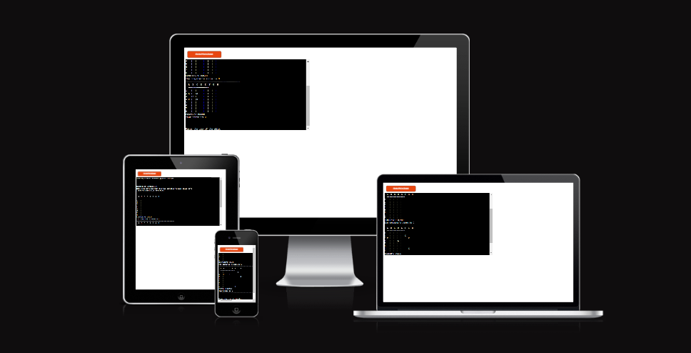
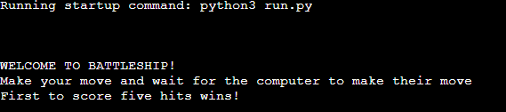
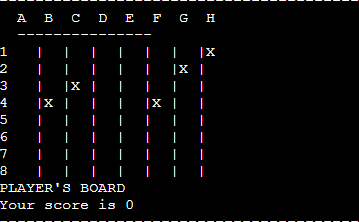
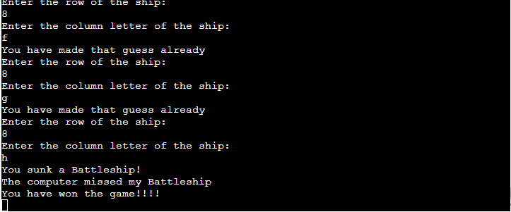
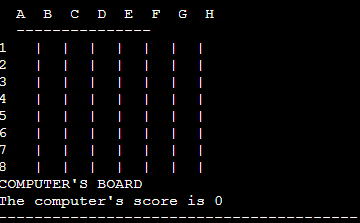
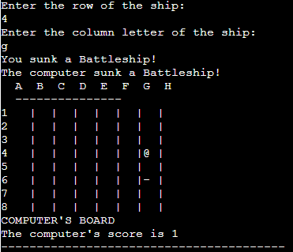
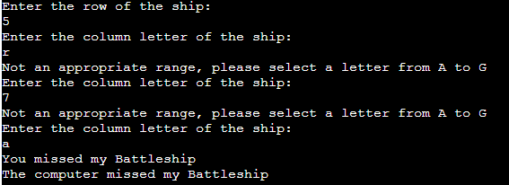
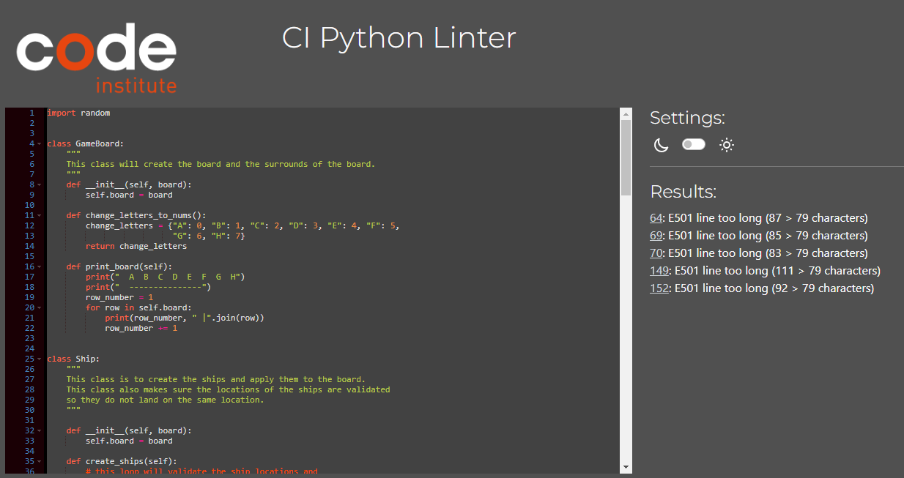

# Classic Battleship

## Link to deployed project: https://battleship-classic.herokuapp.com/

I have created my take on the classic Battleship game to be played on Command Line. I took the original
size of an 8x8 game and reproduced it to be played easily. The ships themselves are all a 1x1 where they 
will be sank after one direct hit.

Users will play against the computer, and will need to sink all 5 enemy battleships to win the game!

## Table of Contents

1. [How To Play](#How-to-play)
2. [Features](#Features)
    - [Existing Features](#existing-features)
    - [Future Features](#future-features)
3. [Data Model](#data-model)
    - [Game Board](#game-board)
    - [Ships](#ships)
    - [Move Functions](#move-functions)
4. [Testing](#testing)
5. [Bugs](#Bugs)
    - [Solved Bugs](#solved-bugs)
    - [Remaining Bugs](#remaining-bugs)
6. [Deployment](#deployment)
7. [Credits](#credits)

## How to play

Battleship is based on the original board game that most people will be familiar with.

### In this version of the game, a user and computer board are generated with five ships for both boards.

- The player's ships are visible to the player, but the computer's ships are concealed to the user.
- The player's ships are displayed to the player using the "X", and will be randomly positioned around the board.
- If the player or computer misses a shot, it will be displayed on the opponents side with a "-".
- If the player or computer sink an enemy ship, it will be displayed using a "@".
- The score will be displayed on every turn and once a player reaches a score of 5 then the enemy can no longer battle!

[Back to Top &uarr;](#classic-battleship)

## Features

### Existing Features
- Playing boards and ship locations are randomly generated.

- Computer moves are random, and will continue to choose different locations.

- Game will continue until a player has no more ships to use.

- computer's ship locations are concealed to ensure a fair game.

- Asks user for input on where to fire.

- Input validation so all shots stay on the board.
- Validation to ensure there are no duplicate shots.

- The input is alphanumeric, the column entry is in letters, like the original game.
- The score is kept.
- Computer ship locations are kept in an list rather than stored on the board like the player's.

### Future Features
- Bigger ships that can withstand more hits
- If a ship is hit by the computer, it will attempt to sink that ship.
- Choose how many ships are used.
- Choose how big the game boards will be.

[Back to Top &uarr;](#classic-battleship)

## Data Model

### Game Board
I decided to use an object oriented approach to designing my version of Battleship. I began by creating a 
Game Board class and assigning some functions to be used throughout the program.
To allow for the use of letters in my columns I created a conversion function. Then I used a function to
print the board.

### Ships
I then used a Ship class to create the ships and assign attributes and functions to the ships. I used seperate functions
for the user and computer ships. The computer ship locations were stored in a list of tuples to be referenced later.
The Random function was used to generate random coordinates for the ships to be located.

### Move Functions

Seperate functions were then used to manipulate the information that was passed by the user ship creation function 
and the random coordinates passed by the computer ship creation function in the ship class. These "move" functions 
allowed the user to input the desired location to take a shot. The shot was then compared to the list of tuples
that was passed in to check for a "hit" or "miss".

The computer "move" function chose a random location to aim, and used validation to ensure there were no duplicate 
shots. The function checked the shot against the character on the player's board and carried out the appropriate 
action.

[Back to Top &uarr;](#classic-battleship)

## Testing
I tested the game by carrying out the following:

- Played several games to ensure a consistent game.
- Ran the code through the code institute pep8 validator. Only line length issues remained that do not affect the 
deployed project.
- Tested the game on VScode.
- Tested the game on the Heroku CLI after deployment.

[Back to Top &uarr;](#classic-battleship)

## Bugs

### Solved Bugs
- I had a problem unpacking the list of tuples that contained the computer ship locations. I attempted to use for
loops to iterate through them. I also "unzipped" the combined lists and tried to simultaneously loop through two
seperate lists to compare the values to the shots. Then I realised that I was comparing these to the actual value
that was on the GameBoard and not the latitude and longtitude of the player's input. I managed to use a single 
"if else" statement to fix the problem.
- I had problems with indexing, so I would have too many or too little ship locations for the computer.
- I had problems creating the correct amount of tuples in the ship creation function for the computer. Used a while 
loop and eliminated duplicate coordinated to ensure correct validation.

### Remaining Bugs
- No known bugs remaining.

[Back to Top &uarr;](#classic-battleship)

## Deployment
### This project was deployed using Code Institute's mock terminal for Heroku
- Cloned the GitHub repository and pinned it to my GitPod dashboard.
- Signed up to Heroku and applied the Code Institute credits for students.
- Assigned the VAR's to include PORT to 8000.
- Set the buildblocks to Python and NodeJS in that order.
- Link the Heroku app to my GitHub repository.
- Click on deploy.

[Back to Top &uarr;](#classic-battleship)

## Credits
- Code Institute for the educational material and instructions for creation and deployment of the project.
- StackOverflow.com for information on problem resolution.
- W3s website gave great information on ways to pass the correct information.
- https://www.youtube.com/@KnowledgeMavens - Gave a great tutorial that helped me figure out the basic foundations
of the project.

[Back to Top &uarr;](#classic-battleship)

